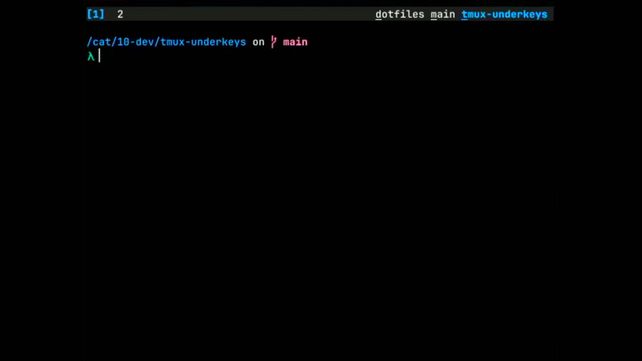

# tmux-underkeys



Visible mnemonic keys for instant tmux session switching.

`tmux-underkeys` underlines one unique character in each session name and binds a trigger key so you can jump directly to that session.

## Why

- Sessions are always visible in the status line, so switching does not require
  opening or listing sessions.
- Each session gets a single character taken from its name, avoiding numbered
  indexes or manual search.
- Switching is reduced to two inputs: trigger key, then the displayed character.
- The mapping is stable as long as session names stay the same, so keys do not
  change unexpectedly.
- Adding more sessions only adds more characters to the status line, not more
  steps to switch.
- No need to remember session positions or reorder-dependent shortcuts.
- No fuzzy matching or typing full names; partial recall is enough if the key is
  visible.
- Works the same across tmux restarts and session re-attachments, since it
  depends on names, not runtime state.
- Eliminates accidental mis-selection from long session lists or similar names.
- Reduces context switching between “where am I” and “where can I go” by keeping
  destinations always in view.
- Scales to large numbers of sessions without introducing hierarchical
  navigation or pagination.

## Installation

With TPM:

```tmux
set -g @plugin 'maxonvim/tmux-underkeys'
```

Choose your trigger key before the plugin line if you do not want the default `C-g`:

```tmux
set -g @underkeys-trigger 'M-s'
set -g @plugin 'maxonvim/tmux-underkeys'
```

The plugin adds the underkey session list to `status-right` automatically.

During local development, load the plugin directly:

```tmux
run-shell /path/to/tmux-underkeys/tmux-underkeys.tmux
```

## Usage

Press the trigger key, then the underlined session key.

Default trigger:

```text
C-g
```

Example:

```text
C-g o
```

Switches to the session whose underlined key is `o`.

## Options

```tmux
set -g @underkeys-trigger 'C-g'
set -g @underkeys-table 'underkeys'
set -g @underkeys-status 'on'
set -g @underkeys-position 'right'
set -g @underkeys-separator ' '
set -g @underkeys-sort 'created'
set -g @underkeys-current-style 'fg=blue,bold'
set -g @underkeys-style 'fg=white'
```

Set `@underkeys-status` to `off` if you want to place the status segment yourself.

Set `@underkeys-sort` to `created`, `name`, or `tmux` to choose the session order used for key assignment.

## How Keys Are Picked

Sessions are processed by creation time by default so new sessions do not shift existing keys.

For each session, the first unused alphanumeric character in the session name becomes its key.

For example:

```text
app   -> a
api   -> p
admin -> d
notes -> n
```
